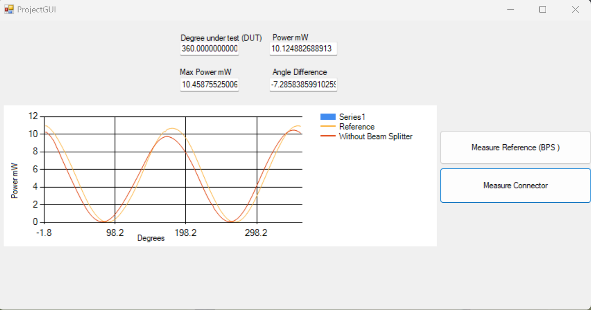

# ProjectGUI

## Overview

ProjectGUI is a C# Windows Forms application that interfaces with a power meter device and performs measurements with and without a beam splitter. It utilizes external DLLs for power measurement and evaluation.

## Features

- **With Beam Splitter Measurement:** Run measurements with a beam splitter and visualize the results on a chart.
- **Without Beam Splitter Measurement:** Run measurements without a beam splitter and visualize the results on a chart.
- **Face Shift Calculation:** Calculate the face shift difference between measurements with and without a beam splitter.

## Dependencies

- [.NET Framework](https://dotnet.microsoft.com/download/dotnet-framework)
- [PowerMeterDLL](https://github.com/Hafiz-Abdul-Mannan/PowerMeterDLL)
- [MeasurementEvaluation DLL](https://link-to-your-measurement-evaluation-dll)

## Setup

1. Clone the repository:

   ```bash
   git clone https://github.com/Hafiz-Abdul-Mannan/ProjectGUI.git
   ```

2. Open the solution in Visual Studio.

3. Configure the serial port settings in the `Form1` constructor (COM port and baud rate).

4. Build and run the application.

## Usage

1. Launch the application.
2. Click the "With Beam Splitter" button to perform measurements with a beam splitter.
3. Click the "Without Beam Splitter" button to perform measurements without a beam splitter.
4. View the real-time chart and results in the UI.

## Screenshots



## License

This project is licensed under the MIT License - see the [LICENSE.md](LICENSE.md) file for details.
